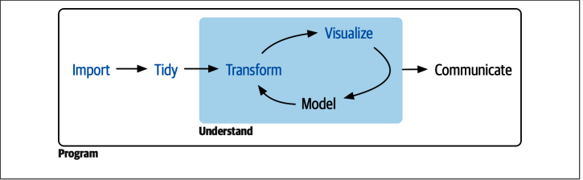

---

marp: true
paginate: true

---

# **R** for Data Science

<!-- _header: in the name of the Alpha and the Omega -->
<!-- footer: S Ahmadreza Anaammi (R Tutorial)-->
<!-- _class: invert   -->

---
# But what is Data science

``
Data  science  is  an  exciting  discipline  that  allows  you  to  transform  raw  data  into
understanding,  insight,  and  knowledge.  
``

---

## A data **scientist** is a professional who creates programming code and combines it with statistical knowledge to create insights from data.

---

## علم داده **مهندسی عمران** داده‌ها است

---

### data science is not a new field, but rather another name for statistics.

---

## data science process

---
## **R** is a programming language for statistical computing and graphics supported by the **R Core** Team and the **R Foundation** for Statistical Computing. Created by statisticians Ross Ihaka and Robert Gentleman, **R** is used among data miners, bioinformaticians and statisticians for data analysis and developing statistical software. The core **R** language is augmented by a large number of extension packages containing reusable code and documentation.

---
https://www.r-project.org/
https://rseek.org/